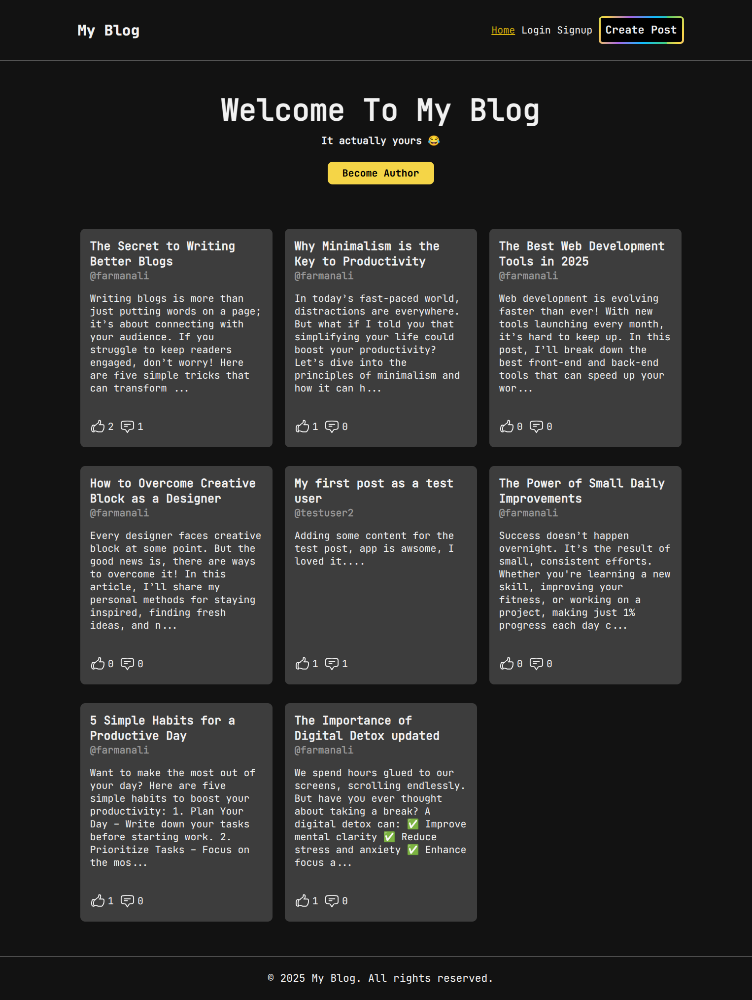
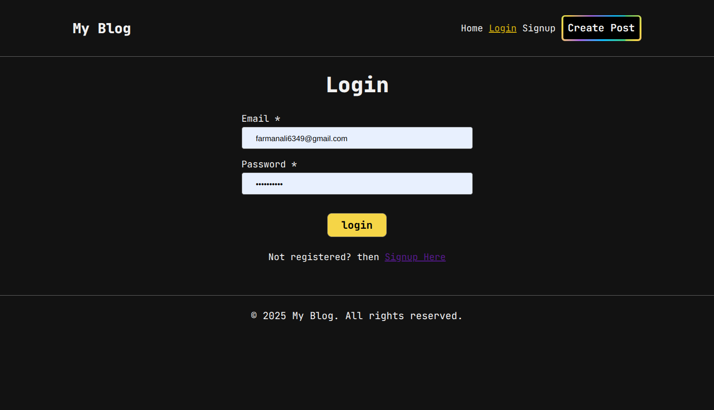
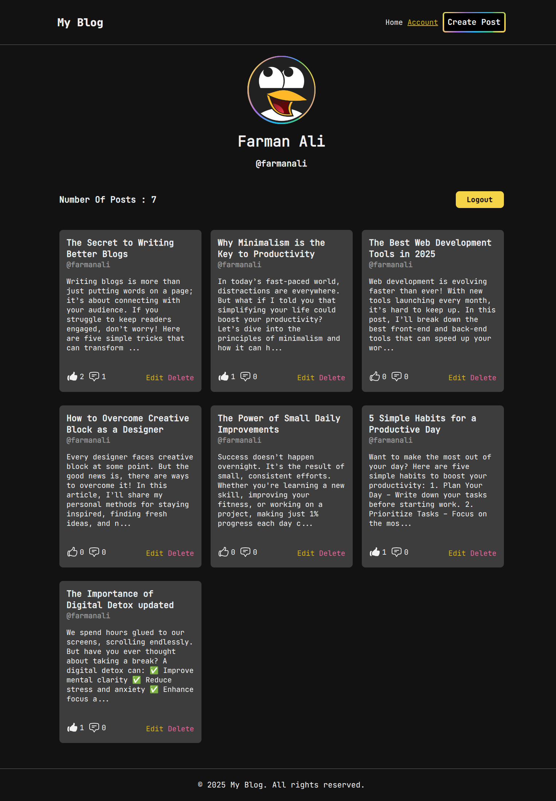
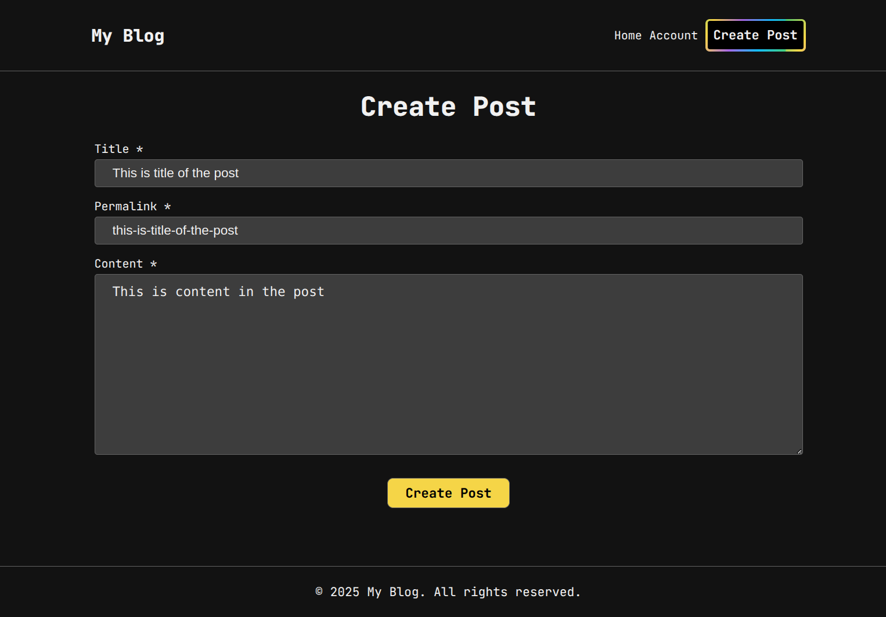
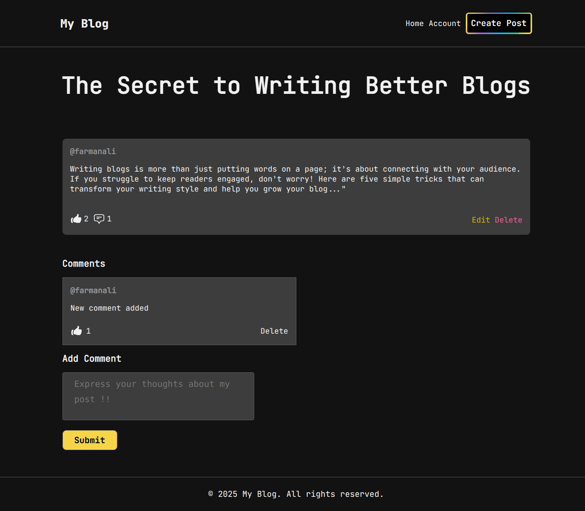

# 📝 My Blog 🚀

## 🌟 Overview

"My Blog" is a **full-stack blogging platform** built with **Node.js, Express, MongoDB, and EJS**. It allows users to **create, manage, and engage with blog posts** while ensuring security and performance. This project showcases my **backend development skills, database management, authentication handling**.

## 🔥 Features

✅ **User Authentication** (Signup, Login, JWT-based Sessions)  
✅ **Create, Edit & Delete Posts** (Rich-text support with TinyMCE)  
✅ **Comment & Like System** (Engagement)  
✅ **User Profiles** (View author details & their posts)  
✅ **Protected Routes** (Only logged-in users can create/edit posts)  
✅ **SEO-friendly Permalinks** (Post URLs are human-readable)

## 🚀 Tech Stack

| Technology             | Purpose                      |
| ---------------------- | ---------------------------- |
| **Node.js**            | Backend logic                |
| **Express.js**         | Server framework             |
| **MongoDB + Mongoose** | Database & Schema Management |
| **EJS**                | Server-side templating       |
| **JWT + bcrypt**       | Authentication & Security    |

## 🎬 Demo & Screenshots

🔗 **Live Demo:** [Coming Soon](#)  
📸 **Screenshots:**  
  
  




## 💻 Installation & Setup

Follow these steps to set up the project locally:

```sh
# Clone the repository
git clone git@github.com:farmanali6349/my-blog.git

# Navigate to project folder
cd my-blog

# Install dependencies
npm install

# Set up environment variables
cp .env.example .env
# Edit .env file with your DB and JWT credentials

# Start the development server
npm run dev
```

## 📂 Folder Structure

```
📂 my-blog
├── 📁 src
│ ├── 📂 models # Mongoose Schemas
│ ├── 📂 routes # Express API Routes
│ ├── 📂 views # EJS Templates
│ ├── 📂 controllers # Business Logic
│ ├── 📂 middlewares # Auth & Security Middleware
├── 📂 public # Static Files (CSS, JS, Images)
├── .env.example # Environment Variable Template
├── package.json # Dependencies & Scripts
├── README.md # Project Documentation
```
